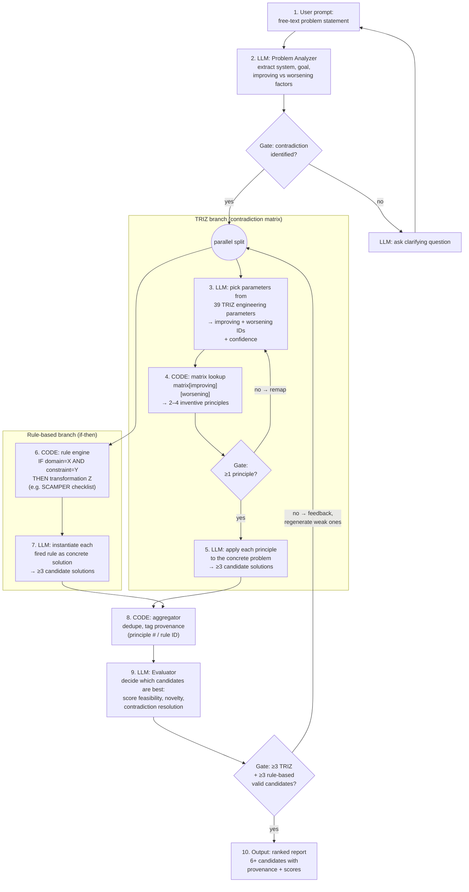

https://claude.ai/share/0a5d326b-8138-4319-81f7-0fe8a54dfbcc https://www.anthropic.com/research/building-effective-agents HWATS THE BEST WAY TO IMPLEMENT TRIZ IN LLM AGENT THAT generates at least 3 candidate solutions using TRIZ via the contradiction matrix and at least 3 using a second method of your choosing (MAYBE SOMETHING RULE BASED)

## Architecture: TRIZ LLM Agent — Data Flow

Pattern (per Anthropic "Building Effective Agents"): **prompt chaining** with programmatic gates,
**parallelization (sectioning)** for the two generation branches, deterministic **code** for the
contradiction matrix + rule engine, and an **evaluator-optimizer** loop at the end.

### Step-by-step data shapes

| Step | Component | Input | Output |
|------|-----------|-------|--------|
| 1 | User | — | free-text problem statement |
| 2 | LLM Analyzer | free text | `{system, goal, improving_factor, worsening_factor}` |
| 3 | LLM Param Picker | factors | `{improving: 14, worsening: 1, confidence}` (TRIZ param IDs) |
| 4 | Matrix lookup (code) | param IDs | inventive principles e.g. `[1, 8, 15, 40]` |
| 5 | LLM TRIZ Generator | principles + problem | ≥3 candidates `{text, principle_id}` |
| 6 | Rule engine (code) | structured facts | fired rules e.g. `[S3, C2, A1]` |
| 7 | LLM Rule Instantiator | fired rules + problem | ≥3 candidates `{text, rule_id}` |
| 8 | Aggregator (code) | all candidates | deduped list with provenance |
| 9 | LLM Evaluator | candidate list | scores + pass/fail per candidate |
| 10 | Output | ranked candidates | final report (6+ solutions) |

### Design principles applied

- **LLM only where language matters** (steps 2, 3, 5, 7, 9); matrix lookup and rule firing are pure functions — deterministic, testable, free.
- **Gates** catch failures early (no contradiction found, empty matrix cell) instead of at the end.
- **Parallel branches** are independent → run concurrently; focused calls beat one call doing both.
- **Evaluator loop** has crisp criteria (≥3 per method, resolves contradiction) + max-iteration stop condition.
- **Provenance tags** (principle #, rule ID) make output auditable and drive dedupe/ranking.

## Explained simply (ELI-highschooler)

Imagine a robot inventor that helps solve engineering problems:

1. **You describe your problem in plain English.**
   Like: *"I want my drone to carry more weight, but a bigger battery makes it too heavy to fly."*

2. **The AI finds the "tug-of-war" in your problem.**
   Every hard problem has a trade-off: making one thing better makes another worse.
   Here: **carrying capacity goes up** but **weight gets worse**. That's called a *contradiction*.

3. **The AI translates your problem into "TRIZ language."**
   TRIZ is an invention method from the 1940s. Its creator studied 40,000+ patents and noticed
   every problem boils down to combinations of just **39 standard parameters** (weight, speed,
   strength, temperature...). The AI picks which two fit your problem.

4. **A simple lookup table gives the answer — no AI needed.**
   The **contradiction matrix** is a 39×39 cheat sheet. Find the row for "thing I'm improving"
   and the column for "thing that gets worse" — the cell lists which of **40 invention tricks**
   worked for past inventors with the same trade-off (e.g. *"segmentation"* = split it into
   pieces, or *"do it in reverse"*). This is just a table lookup, like a spreadsheet.

5. **The AI turns those generic tricks into real ideas.**
   "Segmentation" alone is vague. Applied to *your* drone: *"Use several small swappable
   batteries instead of one big one."* One idea per trick → **at least 3 ideas.**

6. **Meanwhile, a second robot works in parallel using simple if-then rules.**
   A checklist like: *"IF something is too heavy, THEN try removing parts. IF one part does one
   job, THEN try making it do two jobs."* The AI fills in the details → **3 more ideas.**

7. **A judge AI picks the winners.**
   It scores all 6+ ideas: Is it realistic? Creative? Does it actually solve the tug-of-war?
   Weak ideas get sent back for a redo.

8. **You get a ranked list of 6+ solutions**, each labeled with which trick or rule produced
   it — so you can trace where every idea came from.

**The clever design choice:** the AI is only used where understanding language matters (reading
your problem, writing ideas, judging). The lookup table and if-then rules are plain code — fast,
free, and they never make things up.